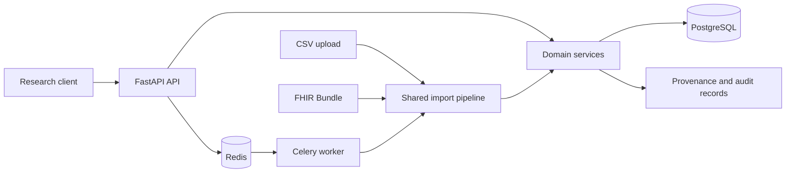

# Clinical Data Platform

A FHIR-based backend that safely ingests clinical-research data, validates it, preserves provenance, and restricts access by study.

## Overview

Clinical Data Platform is a backend service designed to help clinical-research teams import inconsistent CSV exports and FHIR Bundles without losing data quality, traceability, or study-level access control.

The project focuses on:

* Normalized CSV and FHIR Bundle ingestion
* Validation, partial-failure reporting, and idempotent imports
* Provenance, audit records, and study-scoped authorization
* Asynchronous processing with operational health checks

## Problem

Clinical research teams often receive data from several systems in inconsistent formats. A failed row must not prevent valid records from being imported, and records must remain traceable to the source that created or re-observed them.

The system also needs to prevent researchers from accessing patients outside their assigned studies. Repeated uploads must be safe, references in FHIR payloads must be resolved consistently, and background work must expose actionable failure diagnostics.

Typical challenges include:

* Incomplete or invalid CSV rows and FHIR resources
* Colliding external identifiers across data sources or studies
* Repeated uploads creating duplicate clinical records
* Unauthorized cross-study access to research subjects

## Solution

The system addresses these challenges by providing:

* One normalized import pipeline for CSV files and scoped FHIR Bundles
* Per-row or per-entry validation reports with `completed`, `partial`, and `failed` outcomes
* Namespaced external identities and payload/study-aware idempotency
* Role-based study access, provenance history, audit logs, and asynchronous workers

## Current Status

### Implemented

* Import of CSV data and FHIR Bundles containing Patient, Encounter, Observation, and ResearchStudy resources
* PostgreSQL persistence, Alembic migrations, Celery/Redis background processing, retries, and failure diagnostics
* API-key roles for administrators, researchers, and auditors; study grants and research-subject isolation
* JSON logs, request IDs, liveness/readiness endpoints, Docker Compose, tests, and CI

### In Progress

* Production-oriented deployment and identity-provider configuration documentation

### Planned

* OAuth2/OIDC-based production authentication
* Object storage for large import payloads
* Broader FHIR profile and terminology validation

Planned capabilities are not included in the current release unless explicitly marked as implemented.

## Architecture



### Main Components

| Component | Responsibility |
| --- | --- |
| FastAPI API | Receives authenticated API requests and exposes OpenAPI documentation |
| Import pipeline | Maps source-specific CSV/FHIR input into validated normalized records |
| Domain services | Applies identity, idempotency, study-access, and persistence rules |
| PostgreSQL | Stores clinical resources, import jobs, provenance, and audit data |
| Celery and Redis | Execute asynchronous imports with retry and timeout handling |

## Key Engineering Decisions

### Shared normalized import pipeline

**Decision:** CSV and FHIR parsers only map source-specific input; validation and domain services are shared.

**Reason:** The same clinical rules, reporting behavior, and persistence guarantees apply regardless of input format.

**Trade-off:** The currently supported CSV schema and FHIR resource scope are deliberately narrow.

### Study-scoped namespaced identity

**Decision:** External identity is stored as `(source_namespace, external_id)` and import idempotency includes payload, study, and namespace.

**Reason:** Two sites can use the same local subject ID without accidentally merging patients.

**Trade-off:** Intentional cross-study linkage requires an explicit shared namespace.

## Technology Stack

| Area | Technology |
| --- | --- |
| Language | Python 3.12 |
| Framework | FastAPI, Pydantic |
| Database | PostgreSQL, SQLAlchemy 2, Alembic |
| Background work | Celery, Redis |
| Testing | pytest, Coverage, Ruff |
| Packaging | Docker Compose |
| CI/CD | GitHub Actions |

## Repository Structure

```text
.
├── app/clinical_data_platform/  # API, domain services, models, and tasks
├── alembic/                     # Database migrations
├── demo/                        # Synthetic CSV and FHIR demonstration data
├── docs/                        # Architecture, security, deployment, and demo notes
├── scripts/                     # Repeatable demo verification
├── tests/                       # Unit and integration tests
├── docker-compose.yml
└── README.md
```

## Getting Started

### Prerequisites

* Docker with Compose v2
* Git

### Installation

```bash
git clone https://github.com/JinyanShao/clinical-data-platform.git
cd clinical-data-platform
```

### Configuration

The development Compose configuration provides synthetic data and a development-only bootstrap token. For production-oriented configuration, review `.env.production.example` and the deployment documentation.

Never commit real credentials or secrets.

### Run Locally

```bash
docker compose up --build
```

Open [http://localhost:8000/docs](http://localhost:8000/docs). The development-only administrator token is `demo-admin-token`.

## Testing

Run the unit suite, linting, and coverage checks:

```bash
python3 -m venv .venv
.venv/bin/python -m pip install -c requirements.lock -e '.[dev]'
.venv/bin/ruff check .
.venv/bin/coverage run -m pytest -q -m 'not integration'
.venv/bin/coverage report
```

Run integration tests with disposable containers:

```bash
.venv/bin/python -m pytest -q -m integration --with-containers
```

## Example Workflow

1. An administrator creates or selects a synthetic ResearchStudy and grants a researcher access.
2. A CSV file or FHIR Bundle is submitted for import.
3. The shared pipeline validates and normalizes each record while preserving row-level failures.
4. A background worker persists valid resources, provenance, and audit records.
5. The researcher can query only patients belonging to authorized studies.

Run the repeatable demonstration after Compose is healthy:

```bash
docker compose exec api python scripts/demo.py
docker compose exec api python scripts/verify_demo.py
```

## Reliability and Safety

The project includes the following reliability measures where applicable:

* Input validation and partial-failure reports
* Idempotent imports and namespaced external identities
* Automated unit and integration tests
* Database migrations and transactional persistence
* Structured logging, request IDs, liveness, and readiness checks
* Environment-based configuration and no committed production credentials

## Limitations

The current version does not yet include:

* Full FHIR profile or terminology validation
* OAuth2/OIDC production authentication
* Production certification or a claim of HIPAA, GDPR, or Swiss FADP compliance

These limitations are documented intentionally to distinguish implemented functionality from future work.

## Roadmap

* [ ] Add OAuth2/OIDC and managed identity for production deployments
* [ ] Move retryable import payloads to object storage
* [ ] Expand supported FHIR resources and terminology validation

## Documentation

Additional documentation is available in the `docs/` directory:

* Architecture and domain model
* Security and deployment guidance
* Demonstration data and reproducible verification
* Database schema and design decisions

## Licence

No open-source licence has been assigned. All rights are reserved by the repository owner.

## Author

Jinyan Shao<br>
Software Engineer — Business Applications, Backend and Automation

* Website: [https://jinyanshao.ch](https://jinyanshao.ch/)
* GitHub: [https://github.com/JinyanShao](https://github.com/JinyanShao)
* LinkedIn: [https://www.linkedin.com/in/jinyanshao/](https://www.linkedin.com/in/jinyanshao/)
