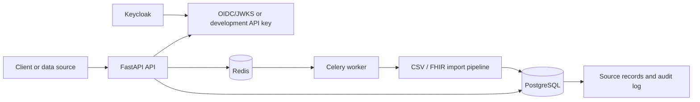
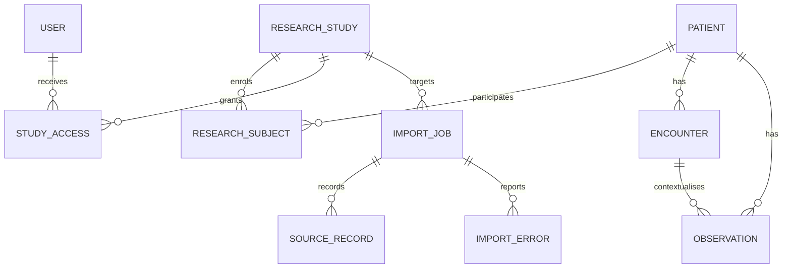

# Clinical Data Platform

FHIR-oriented backend platform for validated clinical-data ingestion, provenance, controlled access, and asynchronous processing.

The repository is a working backend service for synthetic clinical-research data. It is not a FHIR server and makes no clinical-use or regulatory-compliance claim.

## What the platform handles

- **Studies** — research-study metadata, access grants, and subject enrolment.
- **Subjects and clinical records** — patients, encounters, and observations, identified by `(source_namespace, external_id)` rather than a bare source ID.
- **Ingestion and processing** — CSV and scoped FHIR Bundle imports run as idempotent background jobs with per-record results.
- **Provenance** — source rows are retained as append-only records of creation and re-assertion.
- **Access boundaries** — API roles and study assignments govern reads; PostgreSQL RLS provides a second boundary for runtime connections.

## System overview


```mermaid
flowchart LR
    Client["Client or data source"] --> API["FastAPI API"]
    API --> Auth["OIDC/JWKS or development API key"]
    API --> DB[("PostgreSQL")]
    API --> Queue[("Redis")]
    Queue --> Worker["Celery worker"]
    Worker --> Import["CSV / FHIR import pipeline"]
    Import --> DB
    DB --> Provenance["Source records and audit log"]
    Keycloak["Keycloak"] --> Auth
```

The API stores an import job before it is dispatched. The worker owns parsing and persistence, so an upload request does not need to remain open while records are processed.

## Core workflows

1. **Create a study.** An administrator creates a `ResearchStudy`, creates or binds users, grants study access, and enrols patients as research subjects.
2. **Import clinical data.** CSV or a FHIR Bundle is accepted as an `ImportJob`. The idempotency key incorporates payload, target study, and namespace.
3. **Validate and process.** CSV rows or supported FHIR resources are normalized. Invalid entries become import errors without discarding valid entries; jobs finish as `completed`, `partial`, or `failed`.
4. **Track provenance.** Each persisted resource is linked to a source row and import job. Re-importing a known resource records a re-assertion instead of overwriting history.
5. **Query or export.** The API exposes clinical resources, jobs, source records, provenance, and audit records within the caller's study boundary. This repository currently exposes query APIs; it does not provide a bulk export format.

## Data model


```mermaid
erDiagram
    RESEARCH_STUDY ||--o{ RESEARCH_SUBJECT : enrols
    PATIENT ||--o{ RESEARCH_SUBJECT : participates
    USER ||--o{ STUDY_ACCESS : receives
    RESEARCH_STUDY ||--o{ STUDY_ACCESS : grants
    PATIENT ||--o{ ENCOUNTER : has
    PATIENT ||--o{ OBSERVATION : has
    ENCOUNTER ||--o{ OBSERVATION : contextualises
    RESEARCH_STUDY ||--o{ IMPORT_JOB : targets
    IMPORT_JOB ||--o{ SOURCE_RECORD : records
    IMPORT_JOB ||--o{ IMPORT_ERROR : reports
```

`Patient`, `Encounter`, and `Observation` carry a namespaced source identity. `ResearchSubject` is the boundary between a patient and a study; it is intentionally separate from the patient record. `SourceRecord` preserves the source payload and its import context, while `AuditLog` records administrative and write actions.

## API and background processing

FastAPI serves the REST API and OpenAPI documentation at `/docs`. The main API groups are:

- clinical resources: patients, encounters, observations;
- research studies, subject enrolment, and access grants;
- CSV/FHIR import submission, import status, row errors, and source records;
- provenance, audit logs, liveness, and readiness.

Celery workers consume jobs through Redis. PostgreSQL stores domain records, job state, provenance, and audit data. Alembic owns schema migrations. Import processing uses transactional persistence and retry-aware job transitions.

## Security and isolation

The development stack supports a local API-key bootstrap token. OIDC mode validates Keycloak access tokens locally against cached JWKS keys and requires exactly one application role: `admin`, `researcher`, or `auditor`.

Study access is enforced in the service layer for patient, encounter, observation, study, and provenance reads. PostgreSQL RLS is enabled for clinical records and studies; API and worker processes are intended to connect as the non-owner `clinical_app` role. The request principal is set as transaction-local RLS context after authentication. Structured logs include request IDs, and write/access changes are recorded in the audit log.

RLS does not protect connections using a PostgreSQL superuser or table owner. See [deployment notes](docs/deployment.md) before using OIDC/RLS outside the local stack.

## Running locally

Docker Compose is the shortest path:

```bash
docker compose up --build --wait
docker compose exec api python scripts/demo.py
docker compose exec api python scripts/verify_demo.py
```

Open [http://localhost:8000/docs](http://localhost:8000/docs). The default stack uses synthetic data and the development-only `demo-admin-token`. If port 8000 is occupied, use `API_PORT=8001` with the Compose commands.

For the local Keycloak/OIDC and non-owner PostgreSQL configuration, follow [deployment notes](docs/deployment.md) and use `compose.identity.yml` with an ignored `.env.identity.local`.

## Testing

The regular suite uses SQLite and eager Celery execution for fast unit and API coverage. It exercises imports, validation, authorization, job state transitions, and FHIR parsing.

```bash
python3 -m venv .venv
.venv/bin/python -m pip install -c requirements.lock -e '.[dev]'
.venv/bin/ruff check .
.venv/bin/pytest -q -m 'not integration'
```

Integration tests use Testcontainers to run PostgreSQL, Redis, and a Celery worker. They cover migrations, PostgreSQL constraints/JSONB, broker-backed imports, and RLS visibility under `clinical_app`.

```bash
.venv/bin/python -m pytest -q -m integration --with-containers
```

GitHub Actions runs linting, tests, migration checks, image builds, SBOM generation, and image vulnerability scanning.

## Current limitations

- The importer supports `Patient`, `Encounter`, `Observation`, and `ResearchStudy`, not the full FHIR resource model or FHIR REST/search surface.
- `fhir.resources` validates supported resource structure. The optional local HL7 Validator adapter is not a complete terminology service; production profile and terminology policy still need operator configuration.
- Import payloads remain in PostgreSQL. Object storage, retention workflows, and malware scanning are not implemented.
- OIDC and RLS are available, but the checked-in Compose stack remains a local development configuration. Production requires TLS, managed secrets, a Keycloak deployment, a non-owner runtime database role, backups, and operational monitoring.
- There is no bulk export API, UI, or regulatory certification claim.

## Repository structure

```text
app/clinical_data_platform/  API, models, services, and Celery tasks
alembic/                     schema migrations
deploy/keycloak/             local Keycloak realm import
demo/                        synthetic CSV and FHIR data
docs/                        deployment, security, and domain notes
tests/                       unit, API, and integration coverage
```

## Licence

No open-source licence has been assigned. All rights are reserved by the repository owner.
