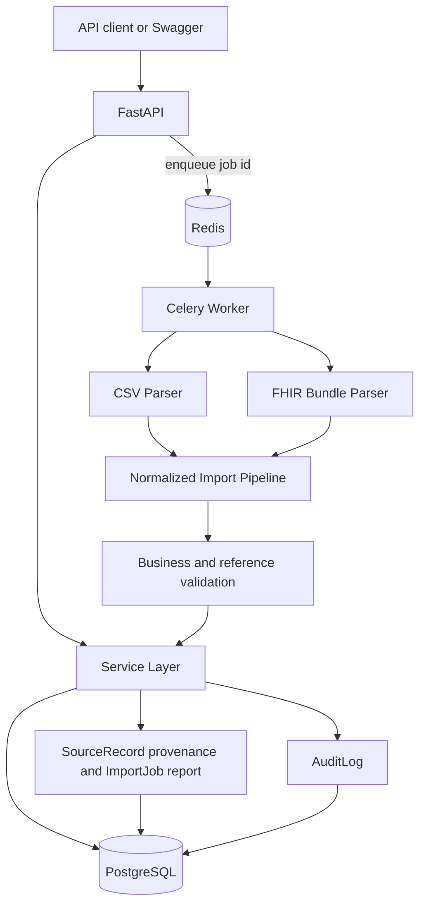
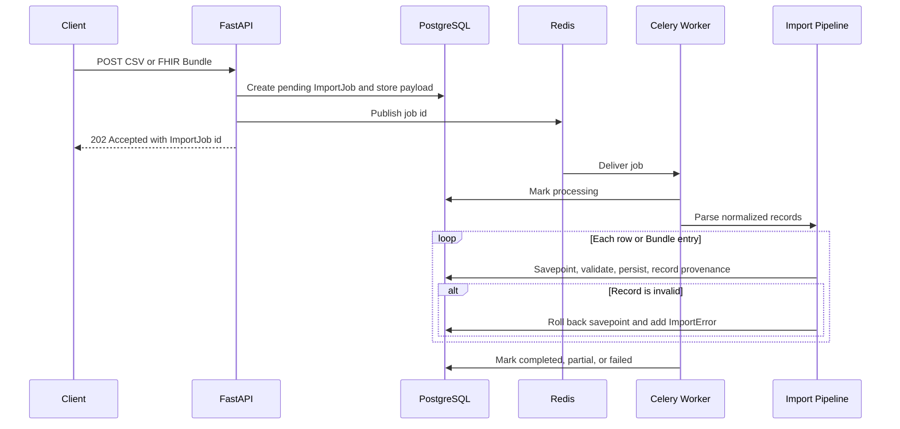
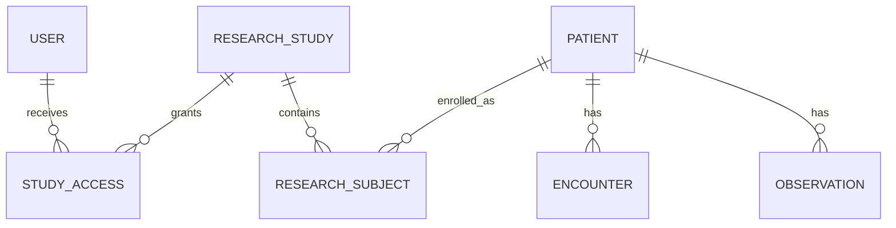

# Architecture

## System context

The platform separates interactive API work from potentially large imports. FastAPI handles authentication, authorization, query operations, and task creation. Celery workers consume import tasks through Redis and use the same Service Layer as manual API writes.

## Import flow

The HTTP request never performs parsing or domain persistence. The payload and job state are committed before publishing so a worker can always recover the task from PostgreSQL. Celery uses late acknowledgement, bounded execution time, exponential retry, and diagnostic failure reasons.

## Shared normalization boundary

`CsvParser` and `FhirBundleParser` produce the same normalized structures: `PatientData`, `EncounterData`, `ObservationData`, and `ResearchStudyData`. `ImportPipelineService` owns all behavior after mapping:

- domain and reference checks;
- external identifier reuse;
- Study enrollment through ResearchSubject;
- SQL savepoint isolation;
- SourceRecord creation;
- ImportError and ImportJob counts.

This boundary prevents CSV and FHIR imports from drifting into separate business implementations.

## Study isolation

Researchers can query a Patient only when a StudyAccess grant and ResearchSubject enrollment connect that user to the patient. Encounter and Observation access follows the owning Patient. Admins bypass Study filtering; auditors cannot query clinical records.

## Operational behavior

- `/health` reports process liveness without external calls.
- `/ready` checks PostgreSQL, Redis, and a short-lived Redis heartbeat emitted by the Celery worker. It does not issue Celery control broadcasts.
- `X-Request-ID` is accepted or generated and returned on every HTTP response.
- Application logs are JSON and include request or import-job correlation fields.
- AuditLog captures manual writes, access grants, subject enrollment, import submission, and retries. Routine GET requests are intentionally excluded.
