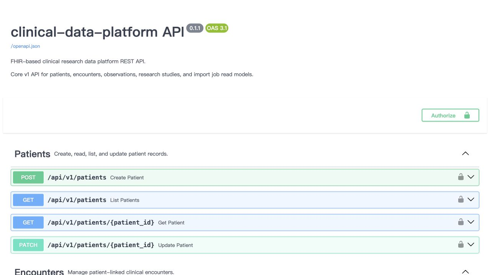

# Demonstration data and reproducible verification

All records in [`../demo`](../demo) are fictional. They are deliberately small
and stable so a reviewer can inspect the complete input and repeat the result.

| Input | Contents | Expected normalized result |
| --- | --- | --- |
| [`clinical_records.csv`](../demo/clinical_records.csv) | 3 patient/encounter/observation rows | 3 patients, 3 encounters, 3 observations |
| [`fhir_bundle.json`](../demo/fhir_bundle.json) | 1 Patient, 1 Encounter, 1 Observation, 1 ResearchStudy | 1 patient, 1 encounter, 1 observation, plus FHIR study metadata |

The inputs share no patient identifier, so a clean demo exposes four patients
to the authorized researcher. Re-running the same inputs under the same demo
study is idempotent: it reuses the existing import job rather than duplicating
clinical resources.

## Repeatable acceptance check

From the repository root, run:

```bash
docker compose up --build --wait
docker compose exec api python scripts/demo.py
docker compose exec api python scripts/verify_demo.py
```

The final command prints a compact JSON report and exits with code `0` only
when all of these assertions pass:

1. `/ready` reports `ready`.
2. Both demo imports completed successfully (or were already completed through
   idempotency).
3. The granted researcher can see exactly the four synthetic demo patients.
4. The researcher cannot create a patient.
5. At least one imported patient has an append-only provenance event.

The verification script calls the public HTTP API only. It is therefore useful
as a post-deploy smoke test too; pass `API_URL` and `ADMIN_API_KEY` when
running it outside the Compose API container.

## Screenshots

The API has no separate user interface; Swagger is its interactive interface.
After starting the stack, open [http://localhost:8000/docs](http://localhost:8000/docs),
select **Authorize**, and enter `demo-admin-token` for the local-only setup.
Use the steps above before taking a release screenshot so the `Import Jobs` and
`Patients` operations reflect the checked demo state.

The following screenshot is generated from the verification run and stored in
the repository when documentation is refreshed:



Its companion [`verification-report.json`](screenshots/verification-report.json)
contains the machine-readable evidence used for the screenshot refresh.
