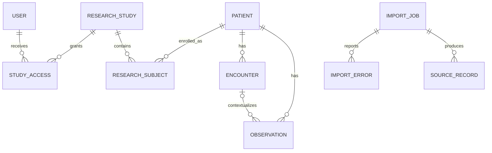

# Domain model

## Clinical resources

- **Patient** is the canonical identity and deduplication boundary. It owns Encounters and Observations.
- **Encounter** represents a time-bounded clinical episode for one Patient.
- **Observation** stores a coded clinical fact for one Patient and may reference an Encounter.
- **ResearchStudy** stores study metadata and an optional external identity used by FHIR imports.

The model is intentionally smaller than the complete FHIR specification. Source-specific FHIR and CSV fields are mapped into these normalized resources before persistence.

## External identity

Following the FHIR `Identifier` model, external identity is the pair `(system, value)`, stored as `(source_namespace, external_id)` on Patient, Encounter, Observation, and ResearchStudy. Uniqueness is enforced on the pair. A bare `external_id` is not globally meaningful: two research sites routinely both call a subject `P001`, and a global unique constraint on the value alone silently merged them into one record.

Namespaces are resolved once per import, in this order:

1. an explicit `source_namespace` supplied by the caller;
2. for FHIR, the resource's own `Identifier.system` when it declares one;
3. a namespace derived from the bound ResearchStudy (`urn:cdp:study:<study_id>`);
4. `urn:cdp:default`.

The default is therefore per-study isolation: identical local identifiers in two studies stay two records. Deliberate cross-study linkage remains possible, but it has to be stated by passing a shared namespace such as `urn:hospital:mrn`.

## Research access

- **ResearchSubject** enrolls a Patient in a ResearchStudy.
- **User** represents an API principal with an admin, researcher, or auditor role.
- **StudyAccess** grants a User access to one ResearchStudy.

A researcher can access a Patient only when both a StudyAccess grant and a ResearchSubject enrollment connect the researcher to that Patient. Encounter and Observation authorization follows the Patient relationship.

## Import and traceability

- **ImportJob** stores input type, payload, optional Study binding, Celery task identity, status, retry/failure data, counters, and timestamps. Idempotency is keyed on `idempotency_key`, derived from the payload checksum together with the target study and namespace, so the same file can be imported for two studies while a genuine re-upload of the same file for the same target stays a no-op.
- **ImportError** records one row or Bundle-entry validation failure, tagged with the `attempt` that produced it. Retries version the error report instead of appending duplicates to it.
- **SourceRecord** is one provenance event: an import asserting a resource. A resource has as many events as imports that touched it, and `action` distinguishes `created` from `reasserted`.
- **AuditLog** records significant manual writes, access changes, subject enrollment, import submission, and retries.

## Relationships

SourceRecord uses `(resource_type, resource_id)` as an application-level resource pointer because provenance can reference several normalized tables. Invalid input receives an ImportError and does not create a successful SourceRecord.
