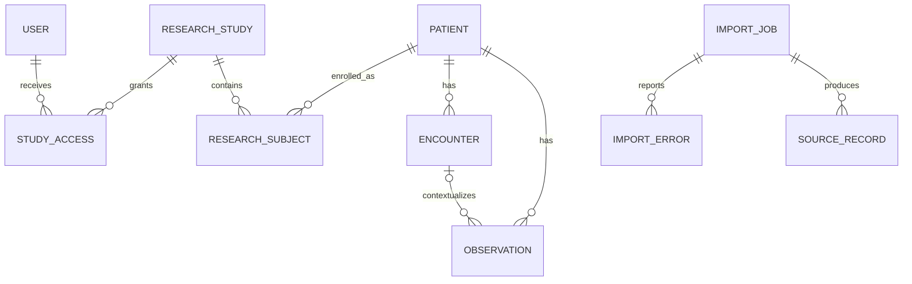

# Domain model

## Clinical resources

- **Patient** is the canonical identity and deduplication boundary. It owns Encounters and Observations.
- **Encounter** represents a time-bounded clinical episode for one Patient.
- **Observation** stores a coded clinical fact for one Patient and may reference an Encounter.
- **ResearchStudy** stores study metadata and an optional external identity used by FHIR imports.

The model is intentionally smaller than the complete FHIR specification. Source-specific FHIR and CSV fields are mapped into these normalized resources before persistence.

## Research access

- **ResearchSubject** enrolls a Patient in a ResearchStudy.
- **User** represents an API principal with an admin, researcher, or auditor role.
- **StudyAccess** grants a User access to one ResearchStudy.

A researcher can access a Patient only when both a StudyAccess grant and a ResearchSubject enrollment connect the researcher to that Patient. Encounter and Observation authorization follows the Patient relationship.

## Import and traceability

- **ImportJob** stores input type, payload, optional Study binding, Celery task identity, status, retry/failure data, counters, and timestamps.
- **ImportError** records one row or Bundle-entry validation failure.
- **SourceRecord** links an original input row or resource to each normalized resource created from it.
- **AuditLog** records significant manual writes, access changes, subject enrollment, import submission, and retries.

## Relationships

SourceRecord uses `(resource_type, resource_id)` as an application-level resource pointer because provenance can reference several normalized tables. Invalid input receives an ImportError and does not create a successful SourceRecord.
